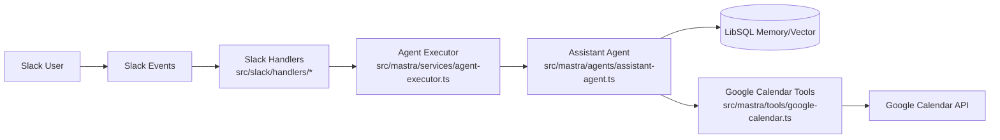

# Mastra Slack Agent - コードベースガイド（最新版）

このドキュメントは、現在の実装（`src/`）に合わせた読み方ガイドです。  
詳細な処理図は `docs/PROCESS_FLOW.md` を参照してください。

関連ドキュメント:
- 全体フロー図: [docs/PROCESS_FLOW.md](./PROCESS_FLOW.md)
- HITL仕様: [docs/specs/HITL_MECHANISM.md](./specs/HITL_MECHANISM.md)
- デプロイ計画: [docs/DEPLOYMENT.md](./DEPLOYMENT.md)

---

## 1. プロジェクト概要

`mastra-slack-agent` は、Slack の `app_mention` を入口として Mastra Agent を実行し、
Google Calendar ツールを利用する AI アシスタントです。

主な特徴:
- Slack Bolt ベースのイベント駆動
- Mastra Agent + Memory（LibSQL / Vector）
- Google Calendar ツール（`listEvents` / `searchEvents` / `createEvent`）
- `createEvent` 実行時の Human-in-the-Loop（承認/却下）

---

## 2. 全体アーキテクチャ



責務の分離:
- Slack 層: 受信イベント、Block Kit、メッセージ更新
- Service 層: ストリーム解釈、承認イベントの検出
- Mastra 層: モデル、メモリ、ツール実行

---

## 3. ディレクトリマップ

```text
src/
├── index.ts
├── mastra/
│   ├── index.ts
│   ├── agents/
│   │   └── assistant-agent.ts
│   ├── services/
│   │   ├── agent-executor.ts
│   │   └── agent-executor.test.ts
│   └── tools/
│       ├── google-calendar.ts
│       └── google-calendar.test.ts
├── slack/
│   ├── bolt-app.ts
│   ├── constants.ts
│   ├── handlers/
│   │   ├── mention-handler.ts
│   │   ├── action-handler.ts
│   │   ├── view-handler.ts
│   │   └── index.ts
│   ├── ui/
│   │   ├── approval-blocks.ts
│   │   └── approval-blocks.test.ts
│   ├── types/
│   │   └── handler-args.ts
│   └── utils/
│       ├── chat-stream.ts
│       ├── error-handler.ts
│       ├── id-parser.ts
│       ├── metadata.ts
│       ├── metadata.test.ts
│       ├── thread-id.ts
│       └── thread-id.test.ts
├── scripts/
│   └── get-google-token.ts
└── tests/
    └── hitl-simulation.ts
```

---

## 4. まず読むべき順序

1. [src/index.ts](../src/index.ts)
2. [src/slack/bolt-app.ts](../src/slack/bolt-app.ts)
3. [src/slack/handlers/mention-handler.ts](../src/slack/handlers/mention-handler.ts)
4. [src/mastra/services/agent-executor.ts](../src/mastra/services/agent-executor.ts)
5. [src/mastra/agents/assistant-agent.ts](../src/mastra/agents/assistant-agent.ts)
6. [src/mastra/tools/google-calendar.ts](../src/mastra/tools/google-calendar.ts)
7. [src/slack/handlers/action-handler.ts](../src/slack/handlers/action-handler.ts)
8. [src/slack/handlers/view-handler.ts](../src/slack/handlers/view-handler.ts)
9. [src/slack/ui/approval-blocks.ts](../src/slack/ui/approval-blocks.ts)
10. [docs/PROCESS_FLOW.md](./PROCESS_FLOW.md)

---

## 5. 起動とイベント登録

エントリーポイントは [src/index.ts](../src/index.ts)。

登録されるハンドラー:
- `app.event('app_mention', handleMention)`
- `app.action(/approve:.+/, handleAction)`
- `app.action(/reject:.+/, handleAction)`
- `app.view(/reject_reason:.+/, handleViewSubmission)`

Slack 起動処理は [src/slack/bolt-app.ts](../src/slack/bolt-app.ts):
- 必須 env (`SLACK_BOT_TOKEN`, `SLACK_SIGNING_SECRET`, 必要なら `SLACK_APP_TOKEN`) を検証
- `SLACK_SOCKET_MODE === 'true'` で Socket Mode を利用

---

## 6. 主要実行フロー

### 6.1 メンション通常フロー

1. `handleMention` がメンション本文を抽出
2. `generateThreadId(channel, thread_ts, ts)` でメモリスコープ確定
3. Slack に `Processing...` メッセージ投稿
4. `streamToSlack(..., executor)` を開始
5. `executeAgent(...)` が `assistantAgent.stream(...)` を実行
6. `text-delta` を受けるたびに Slack メッセージ更新
7. 完了時に最終文面を反映し、`Processing...` メッセージを削除

### 6.2 承認が必要なフロー（HITL）

`createEvent` 呼び出し時は `tool-call-approval` が発火し、
`executeAgent` は `approval-required` を返します。

その後:
- `mention-handler` が承認 UI（Approve/Reject）をスレッドに投稿
- Approve: `action-handler` -> `approveToolCall(...)`
- Reject: `action-handler` -> モーダル表示 -> `view-handler` -> `declineToolCall(...)`

補足:
- 現在 `view-handler` 内の却下理由はログ出力のみで、`declineToolCall` には渡していません（Agent API 未対応コメントあり）。

---

## 7. 主要コンポーネント詳細

### 7.1 Mastraインスタンス

ファイル: [src/mastra/index.ts](../src/mastra/index.ts)

- `new Mastra({ agents, storage, logger })`
- storage は `LibSQLStore`（`TURSO_DATABASE_URL` 優先、未設定時 `file:mastra.db`）
- logger は `PinoLogger`（level: `info`）

### 7.2 Assistant Agent

ファイル: [src/mastra/agents/assistant-agent.ts](../src/mastra/agents/assistant-agent.ts)

- model: `openai('gpt-4o')`
- memory:
  - `LibSQLStore` + `LibSQLVector`
  - embedder: `text-embedding-3-small`
  - `lastMessages: 50`
  - semantic recall: `scope: 'thread'`, `topK: 5`, `messageRange: 100`
- tools:
  - `listEvents`
  - `searchEvents`
  - `createEvent`（`requireApproval: true` を付与）

### 7.3 Agent Executor

ファイル: [src/mastra/services/agent-executor.ts](../src/mastra/services/agent-executor.ts)

公開関数:
- `executeAgent(agent, query, { resourceId, threadId }, onStreamChunk?)`
- `approveToolCall(agent, runId, toolCallId, onStreamChunk?)`
- `declineToolCall(agent, runId, toolCallId, onStreamChunk?)`

戻り型（`executeAgent`）:
- `completed`
- `approval-required`
- `error`

実装ポイント:
- `handleStream()` が `fullStream` を最後まで消費
- `tool-call-approval` 検出時に `runId/toolCallId/toolName/args` を保持
- `text-delta` を `onStreamChunk` 経由で Slack 側へ反映
- `No snapshot found` は「Session expired」に変換

### 7.4 Slack ストリーム制御

ファイル: [src/slack/utils/chat-stream.ts](../src/slack/utils/chat-stream.ts)

- `startStream`: 実体はプレースホルダーメッセージ投稿
- `appendStream`: `chat.update` で全文更新
- `stopStream`: 最終テキストで確定

注意:
- 現在は固定間隔のスロットリングは実装していません。

---

## 8. ID・メタデータ設計

### 8.1 Action ID

ファイル: [src/slack/constants.ts](../src/slack/constants.ts), [src/slack/utils/id-parser.ts](../src/slack/utils/id-parser.ts)

形式:
- 新形式: `{type}:{agentName}:{runId}:{toolCallId}`
- 旧形式: `{type}:{runId}:{toolCallId}`（後方互換。`agentName='calendar'` 扱い）

例:
- `approve:unified:run-123:tc-456`
- `reject:unified:run-123:tc-456`
- `reject_reason:unified:run-123:tc-456`

### 8.2 Modal metadata

ファイル: [src/slack/utils/metadata.ts](../src/slack/utils/metadata.ts)

`private_metadata` に以下を JSON で保持:
- `agentName`
- `runId`
- `toolCallId`
- `channelId`
- `messageTs`
- `threadTs?`

---

## 9. メモリスコープ管理

ファイル: [src/slack/utils/thread-id.ts](../src/slack/utils/thread-id.ts)

```ts
export const generateThreadId = (
  channel: string,
  thread_ts: string | undefined,
  ts: string,
): string => {
  const threadTimestamp = thread_ts || ts;
  return `${channel}:${threadTimestamp}`;
};
```

意味:
- スレッド返信: `thread_ts` を使用
- 新規投稿: ルート投稿の `ts` を使用

これにより、Slack スレッド単位でメモリが分離されます。

---

## 10. Google Calendar ツール

ファイル: [src/mastra/tools/google-calendar.ts](../src/mastra/tools/google-calendar.ts)

提供ツール:
- `listEvents`
- `searchEvents`
- `createEvent`

共通実装:
- OAuth2 (`GOOGLE_CLIENT_ID`, `GOOGLE_CLIENT_SECRET`, `GOOGLE_REFRESH_TOKEN`) を必須化
- `GOOGLE_CALENDAR_ID` 未設定時は `primary`
- エラー時は `{ error: string }` 形式で返却

`createEvent`:
- ツール定義でも `requireApproval: true`
- Agent 側でも `...createEvent, requireApproval: true` を付与

---

## 11. 主要環境変数

必須:
- `SLACK_BOT_TOKEN`
- `SLACK_SIGNING_SECRET`
- `OPENAI_API_KEY`
- `GOOGLE_CLIENT_ID`
- `GOOGLE_CLIENT_SECRET`
- `GOOGLE_REFRESH_TOKEN`

Socket Mode 利用時:
- `SLACK_SOCKET_MODE=true`
- `SLACK_APP_TOKEN`

任意:
- `TIMEZONE`（デフォルト `Asia/Tokyo`）
- `PORT`（デフォルト `3000`）
- `GOOGLE_CALENDAR_ID`（デフォルト `primary`）
- `TURSO_DATABASE_URL`
- `TURSO_AUTH_TOKEN`

---

## 12. 開発コマンド

`package.json` の主要スクリプト:

```bash
# 開発
npm run dev          # Mastra Playground
npm run dev:slack    # Slack bot (watch)
npm run start:slack  # Slack bot (non-watch)

# 品質
npm run typecheck
npm run lint
npm run lint:fix
npm run format
npm run format:check

# テスト
npm test
npm test src/mastra/services/agent-executor.test.ts

# ビルド
npm run build
npm run start
```

コミット前の最低チェック:
- `npm run typecheck`
- `npm run lint`

---

## 13. テスト観点

主要テスト:
- [src/mastra/services/agent-executor.test.ts](../src/mastra/services/agent-executor.test.ts)
  - `text-delta` 結合
  - `tool-call-approval` 検出
  - Snapshot期限切れエラー変換
- [src/slack/ui/approval-blocks.test.ts](../src/slack/ui/approval-blocks.test.ts)
  - 承認ボタンID生成
  - reject modal metadata
- [src/slack/utils/metadata.test.ts](../src/slack/utils/metadata.test.ts)
- [src/slack/utils/thread-id.test.ts](../src/slack/utils/thread-id.test.ts)
- [src/mastra/tools/google-calendar.test.ts](../src/mastra/tools/google-calendar.test.ts)

手動確認:
- `npx tsx src/tests/hitl-simulation.ts`

---

## 14. 拡張時のチェックリスト

新しい Mastra ツール追加時:
1. `src/mastra/tools/` に追加
2. `assistant-agent.ts` の `tools` に登録
3. 重要操作なら `requireApproval: true`
4. 必要なら `docs/PROCESS_FLOW.md` と本書を更新
5. テスト追加

新しい Slack UI アクション追加時:
1. `constants.ts` に ID/文言追加
2. `id-parser.ts` で形式を担保
3. handler を `src/index.ts` で登録
4. `approval-blocks.test.ts` 形式でユニットテスト追加

---

## 15. 注意点（現実装ベース）

- `action-handler.ts` / `view-handler.ts` では `parseActionId` / `parseCallbackId` の失敗を `IdParseError` で明示的に扱っています。
- `mention-handler.ts` の `updateMessageForResult` で、完了時は最初の `Processing...` メッセージを削除してスレッドを整理します。
- `chat-stream.ts` は Slack ネイティブの stream API ではなく、`postMessage` + `update` による擬似ストリーミング実装です。
