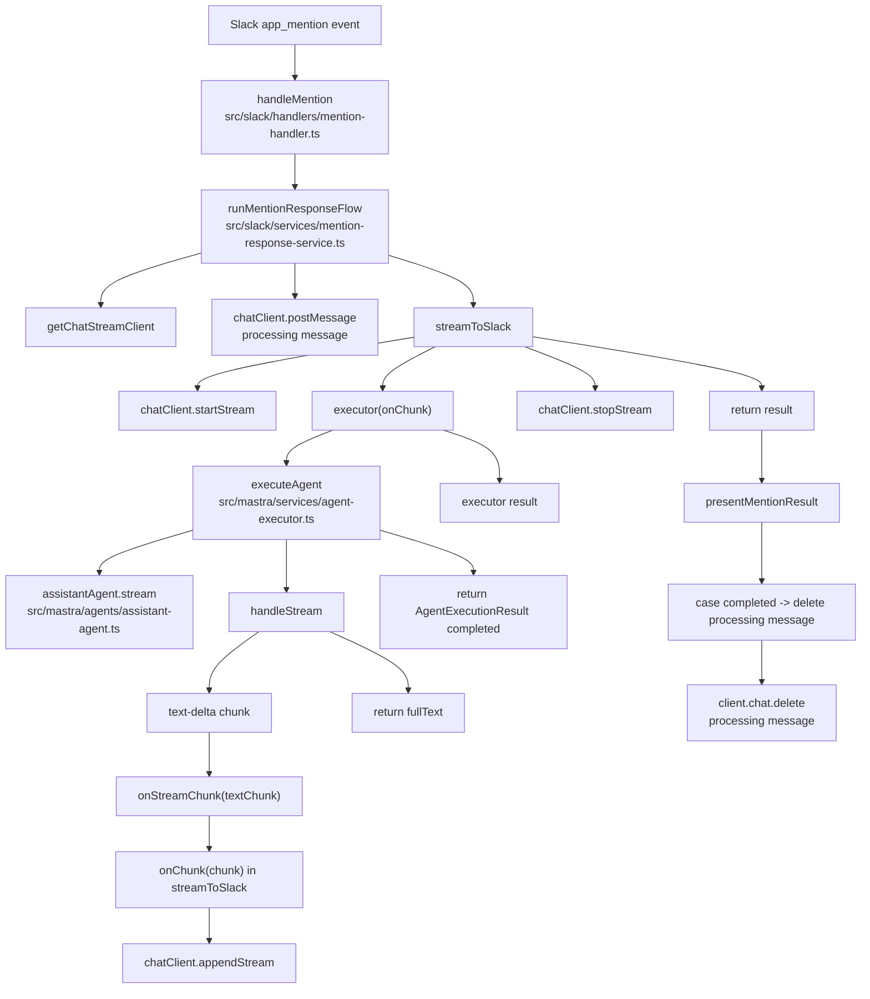

# app_mention から通常テキスト応答までの読み方

このドキュメントは、Slack で bot に最初にメンションして、`tool call` なしで通常テキストが返るケースに限定して、処理順とコードの読み順を整理したものです。

対象コード:

- `src/index.ts`
- `src/slack/handlers/mention-handler.ts`
- `src/slack/services/mention-response-service.ts`
- `src/slack/services/agent-result-presenter.ts`
- `src/slack/utils/chat-stream.ts`
- `src/mastra/services/agent-executor.ts`
- `src/mastra/agents/assistant-agent.ts`

## 前提条件（このドキュメントの範囲）

- 入力は `app_mention` イベント
- エージェントは `tool-call-approval` を発行しない
- 最終的に `AgentExecutionResult` の `type: 'completed'` で終わる

## 全体の実行順（最短版）

1. `src/index.ts` で `app.event('app_mention', handleMention)` が登録されている
2. Slack から `app_mention` が来ると `handleMention` が実行される
3. `handleMention` が入力チェック後に `runMentionResponseFlow(...)` を呼ぶ
4. `runMentionResponseFlow` が進捗メッセージを投稿して `streamToSlack({ ... })` を呼ぶ
5. `streamToSlack` が `chat.startStream` を開始し、`executor` を実行する
6. `executor` 内で `executeAgent(...)` を呼ぶ
7. `executeAgent` が `assistantAgent.stream(...)` を実行し、`text-delta` を受ける
8. `text-delta` ごとに `onChunk` が呼ばれ、`appendStream` で Slack に追記される
9. ストリーム完了後、`executeAgent` は `{ type: 'completed', text }` を返す
10. `streamToSlack` が `stopStream` して `runMentionResponseFlow` に戻る
11. `runMentionResponseFlow` が `presentMentionResult` の `completed` 分岐で進捗メッセージを削除して終了

## 関数呼び出し関係図（通常応答）

## どこから読むか（推奨順）

### 1. イベント入口を確認する

`src/index.ts`

- `app.event('app_mention', handleMention);`
- まず「どのイベントがどのハンドラに入るか」だけ確認する

### 2. メンションハンドラの責務を追う

`src/slack/handlers/mention-handler.ts`

注目ポイント:

- `cleanText` でメンション文字を除去
- 入力チェック（空メンション / user 不在）
- `runMentionResponseFlow(...)` を呼ぶだけ

このファイルで把握すべきこと:

- 「イベント入口」と「入力バリデーション」が責務
- 実行フロー本体は `mention-response-service` に委譲

### 3. メンション応答サービスを追う

`src/slack/services/mention-response-service.ts`

注目ポイント:

- `chatClient.postMessage(...)` で進捗メッセージ投稿
- `streamToSlack({ ... })` 呼び出し
  - `executor` は `executeAgent(..., onChunk)` を呼ぶ
- `presentMentionResult(...)` で `completed/approval-required/error` を分岐

このファイルで把握すべきこと:

- Slack UI更新とエージェント実行のオーケストレーション責務

### 3.5 結果プレゼンテーションを追う

`src/slack/services/agent-result-presenter.ts`

注目ポイント:

- `presentMentionResult` は `approval-required` で承認UI投稿 + waiting 表示更新
- `presentMentionResult` は `completed` で Processing メッセージを削除
- `presentMentionResult` は `error` を `handleError` に委譲
- `presentActionResult` は `completed` で追加 UI 更新なし、`approval-required/error` は `handleError` に委譲

### 4. ストリーミング配信の仕組みを追う

`src/slack/utils/chat-stream.ts`

注目ポイント:

- `streamToSlack({ ... })` の引数
  - `executor` は「onChunk を受けて結果を返す関数」
- `startStream(...)` で Slack ストリーム開始
- `executor(async (chunk) => { ... })` のコールバックが `onChunk` 本体
- `onChunk` が呼ばれるたびに `appendStream(...)`
- 完了時に `stopStream(...)`

このファイルで把握すべきこと:

- 生成はしない。Slack への表示更新だけ担当
- `onChunk` はここで定義して `executeAgent` 側に渡している

### 5. エージェント実行と chunk 解釈を追う

`src/mastra/services/agent-executor.ts`

注目ポイント:

- `executeAgent(...)` が `agent.stream(...)` を呼ぶ
- `handleStream(...)` で `fullStream` を `for await` で消費
- `typedChunk.type === 'text-delta'` のとき:
  - `fullText` に加算
  - `onStreamChunk(textChunk)` を await（= `onChunk` 呼び出し）
- `tool-call-approval` がなければ最後に `fullText` を返す
- `executeAgent(...)` 側で `{ type: 'completed', text }` に包む

このファイルで把握すべきこと:

- LLM ストリームの chunk をどう最終結果に変換しているか
- `text-delta -> onChunk -> Slack append` の橋渡し

### 6. エージェント構成を確認する

`src/mastra/agents/assistant-agent.ts`

注目ポイント:

- `model: openai('gpt-4o')`
- `memory` の設定（thread スコープ）
- `tools` 定義（通常応答では未使用でも、ここに存在する）

このファイルで把握すべきこと:

- `executeAgent` が実行する実体が何か
- メモリが `thread` 単位で効くこと

## 通常応答ケースの時系列（詳細）

1. ユーザーがチャンネルで `@bot ...` を投稿
2. Slack Bolt が `app_mention` を受信し `handleMention` 実行
3. `handleMention` が質問文を整形し `runMentionResponseFlow` を呼ぶ
4. `runMentionResponseFlow` が進捗メッセージを投稿
5. `runMentionResponseFlow` が `streamToSlack` を呼ぶ
6. `streamToSlack` が `chat.startStream` 実行
7. `streamToSlack` が `executor` を呼ぶ
8. `executor` は `executeAgent(..., onChunk)` 実行
9. `executeAgent` は `assistantAgent.stream` を開始
10. `handleStream` が `text-delta` を読むたびに `onChunk` 実行
11. `streamToSlack` 側の `onChunk` が `appendStream` を実行
12. 生成完了で `executeAgent` が `{ type: 'completed', text }` を返す
13. `streamToSlack` が `stopStream` して `result` を返す
14. `runMentionResponseFlow` の `presentMentionResult` が `completed` 分岐で進捗メッセージ削除

## 読み解きのコツ

- まず「どこで await しているか」を追う
- 次に「誰が callback (`onChunk`) を定義し、誰が呼ぶか」を追う
- 最後に「戻り値の型」がどこで狭まるかを見る
  - `streamToSlack<TResult>`
  - `executeAgent -> AgentExecutionResult`

この3点を押さえると、`tool call` がない通常応答はほぼ一直線で追える。
