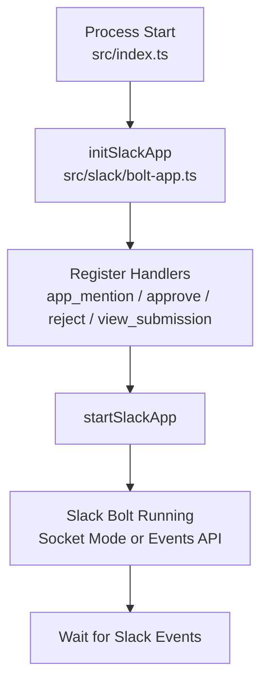
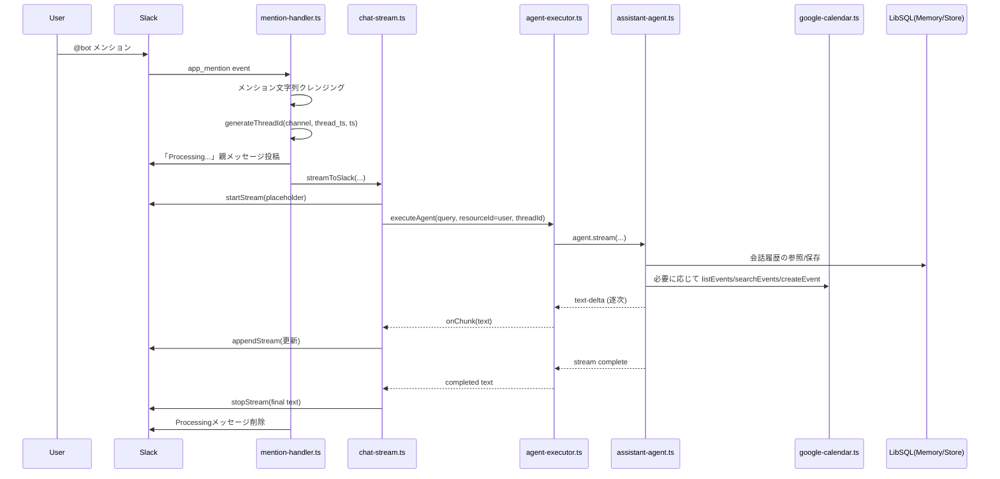
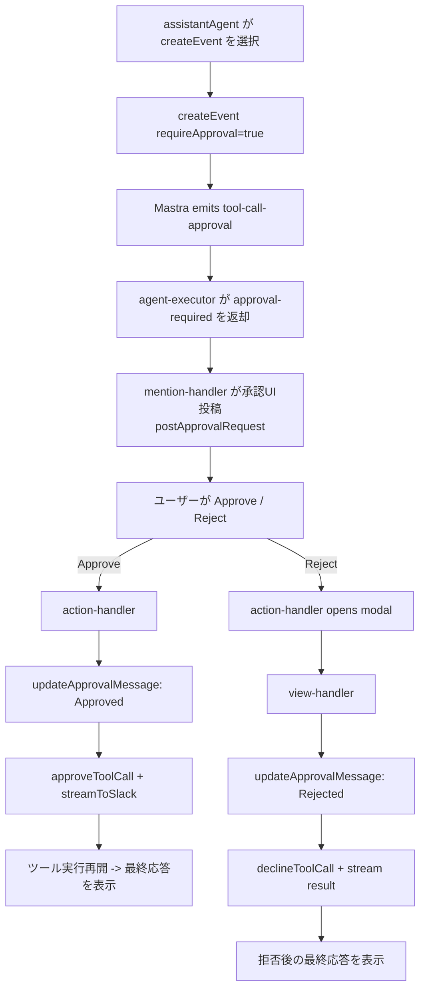
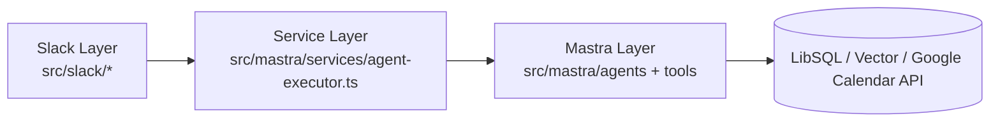

# Mastra Slack Agent 全体処理フロー

このドキュメントは、`mastra-slack-agent` の処理を「起動」「通常応答」「HITL承認/却下」に分けて図示したものです。  
実装の参照先は `src/index.ts` / `src/slack/*` / `src/mastra/*` です。

## 1. 起動からイベント待ち受けまで

### 解説

1. エントリーポイント `src/index.ts` で `.env` を読み込み、Slack App を初期化します。
2. 以下のハンドラーを登録します。
3. `app_mention` -> `handleMention`
4. `approve:*` / `reject:*` -> `handleAction`
5. `reject_reason:*` (modal submit) -> `handleViewSubmission`
6. `startSlackApp()` で待ち受けを開始し、以降は Slack イベント駆動で処理が進みます。

## 2. 通常のメンション応答フロー

### 解説

1. `handleMention` が Slack イベントを受け取り、入力テキストを整形します。
2. メモリスコープ用の `threadId` を `channel:thread_ts(or ts)` 形式で生成します。
3. `streamToSlack` が Slack 側の疑似ストリーミング (`postMessage` + `update`) を管理します。
4. `executeAgent` が `assistantAgent.stream()` を呼び、`text-delta` を受けるたびに Slack へ反映します。
5. エージェントは `Memory + LibSQLVector` を使って thread 単位の会話文脈を参照します。
6. ツール不要ならそのまま完了し、最終テキストを表示して終了します。

## 3. HITL（承認/却下）フロー

### 解説

1. `createEvent` は `requireApproval: true` なので、実行前に Mastra が停止します。
2. `agent-executor` は `tool-call-approval` を検知し、`runId` / `toolCallId` を保持して Slack 層へ返します。
3. `approval-blocks.ts` が Block Kit ボタンを生成し、承認依頼メッセージを投稿します。
4. Approve の場合は `approveToolCall(runId, toolCallId)` で再開し、結果をストリーミング表示します。
5. Reject の場合はモーダル入力後 `declineToolCall(runId, toolCallId)` を実行し、拒否後の応答を表示します。

## 4. レイヤー責務（実装上の分離）

### 解説

1. Slack Layer はイベント受信・UI更新（投稿/更新/モーダル）だけを担当します。
2. Service Layer はストリーム解釈と `tool-call-approval` 検知を担当します。
3. Mastra Layer は LLM 推論・メモリ・ツール実行（Calendar API）を担当します。

## 5. 主要ファイル対応表

- `src/index.ts`: 初期化とハンドラー登録
- `src/slack/handlers/mention-handler.ts`: メンション受信と通常フロー起点
- `src/slack/handlers/action-handler.ts`: Approve/Reject ボタン処理
- `src/slack/handlers/view-handler.ts`: Reject モーダル送信処理
- `src/slack/utils/chat-stream.ts`: Slack 表示のストリーミング制御
- `src/mastra/services/agent-executor.ts`: Agent stream 処理と承認イベント検知
- `src/mastra/agents/assistant-agent.ts`: モデル・メモリ・ツール構成
- `src/mastra/tools/google-calendar.ts`: Calendar ツール実装
